# MBSE Framework for Electromechanical Medical Devices — Master Outline

## Document purpose

This outline defines the complete structure of the MBSE Framework Definition — the reference document that will guide every subsequent Enterprise Architect build phase. Each Part (A through G) will be delivered as a separate `.md` file with embedded Mermaid diagrams, reviewed and confirmed before moving to the next.

The framework targets **electromechanical medical devices with active actuation** — devices using pumps, motors, stepper motors, sensors, electronics, and embedded firmware — and covers the full product lifecycle under ISO 13485, IEC 60601-1, ISO 14971, IEC 62304, IEC 62366-1, and ISO 11608-4.

A running **case study** (stepper-motor-driven peristaltic dosing module) is introduced in Part F and threaded through Parts A–E retroactively during the EA build phases.

---

## Framework overview — how the seven parts connect

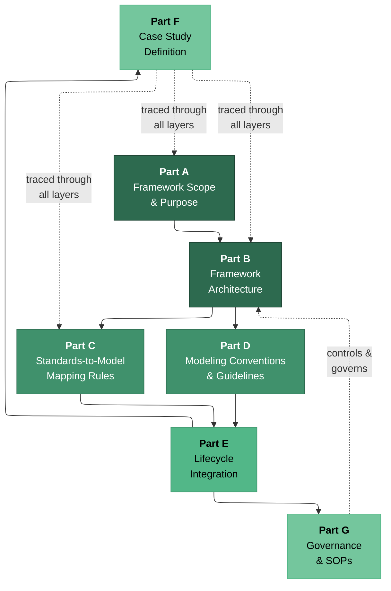

**Reading order:** A → B → C & D (parallel, both depend on B) → E → F & G (parallel, both depend on E).

**Dependency logic:**
- Part A defines *what* the framework covers and *why*.
- Part B defines *how the model is structured* — package hierarchy, projection principle, DHF/DMR backbone.
- Parts C and D define *what goes into the model* — C translates standards into model patterns, D defines the syntax and conventions.
- Part E defines *when things happen* — lifecycle phases, review gates, V-model mapping, baseline strategy.
- Part F applies everything to a concrete subsystem so the framework is practical, not theoretical.
- Part G defines *who controls the model and how* — ownership, SOPs, change control.

---

## Part A — Framework Scope and Purpose

**File:** `Part_A_Framework_Scope_and_Purpose.md`

### A.1 Problem statement
- Why document-centric development fails for electromechanical medical devices
- The multi-domain challenge: mechanical, electrical, firmware, sensor, fluid path — all coupled
- Traceability gaps, siloed safety analysis, slow root cause investigation, fragile design transfer
- Regulatory audit vulnerability when product knowledge lives in disconnected documents

### A.2 What MBSE solves in this context
- Single authoritative model with controlled projections (not one monolithic diagram)
- Bidirectional traceability from stakeholder needs through design, risk, verification, and manufacturing
- Model-based impact analysis for change control, CAPA, and root cause investigation
- Queryable compliance evidence: "show all EP-tagged requirements without verification" becomes a model query, not a manual hunt

### A.3 Framework scope boundaries
- **In scope:** Concept definition, requirements, architecture (structural + behavioral), interface control, risk management, verification/validation, manufacturing transfer, issue management, root cause analysis, post-market hooks
- **In scope device types:** Electromechanical devices with active actuation — infusion pumps, electronic injection systems, on-body delivery systems, motorized auto-injectors, and similar pump/motor/sensor/firmware combinations
- **Out of scope:** Pure software-as-medical-device (SaMD), passive devices, in vitro diagnostics, clinical trial design, full PLM/ERP implementation

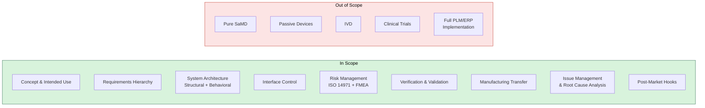

### A.4 Standards baseline
- ISO 13485:2016 — QMS and design controls
- IEC 60601-1 (Ed 3.2) — Basic safety, essential performance, PEMS (Clause 14)
- IEC 60601-1-2 — EMC
- IEC 60601-1-8 — Alarm systems
- IEC 60601-1-11 — Home healthcare
- ISO 14971:2019 — Risk management
- IEC 62304:2006/Amd 1:2015 — Software lifecycle
- IEC 62366-1:2015/Amd 1:2020 — Usability engineering
- ISO 11608-1 — Needle-based injection systems (dose accuracy)
- ISO 11608-4:2022 — Electronic needle-based injection systems
- SysML 1.6 / UML 2.5.1 — Modeling languages (OMG)
- OSLC — Cross-tool lifecycle linking (optional, enabling)

### A.5 Engineering objectives
- Objective 1: Every requirement traces to a source, a design element, and a verification artifact
- Objective 2: Every essential performance function is tagged, risk-linked, and independently verifiable
- Objective 3: Every risk control traces to a design block, a verification test, and a residual risk judgement
- Objective 4: Every interface is defined with typed ports, acceptance criteria, and integration test targets
- Objective 5: Impact analysis for any change or field issue can be executed as a model query
- Objective 6: Manufacturing acceptance criteria trace back to design requirements and risk controls
- Objective 7: The model serves as the authoritative index for DHF, DMR, and risk management file

### A.6 Diagram: Framework coverage mapped to product lifecycle

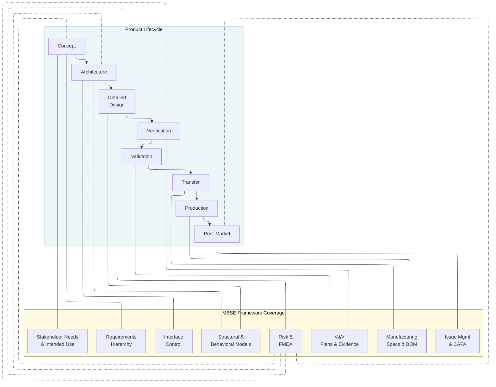

### A.7 Intended audience and usage
- Systems engineers, firmware engineers, hardware engineers, quality/regulatory, verification leads, manufacturing engineers
- Used as a reference during EA model construction
- Used as a training/onboarding resource for team members new to MBSE in medical devices

### Diagrams in Part A
| Diagram | Mermaid Type | Purpose |
|---------|-------------|---------|
| Scope boundary | Flowchart (LR) | Show in-scope vs out-of-scope |
| Lifecycle coverage | Flowchart (LR) | Map framework elements to lifecycle phases |
| Standards ecosystem | Flowchart (TD) | Show how the six standards relate to each other |

---

## Part B — Framework Architecture

**File:** `Part_B_Framework_Architecture.md`

### B.1 Core principle: single model with controlled projections
- The model is not one diagram — it is an organized repository of interconnected elements
- "Projections" are views generated for specific audiences (reviewers, auditors, manufacturing, firmware team)
- Each projection is a filtered, frozen snapshot — the model is the living source
- Analogy: the model is a database; documents are reports generated from queries

### B.2 Package hierarchy — the backbone of the EA project
- 10-package structure mapped to regulated artifacts
- Each package has a defined owner, defined contents, and defined relationships to other packages
- Package hierarchy directly supports DHF structure, DMR structure, and risk management file structure

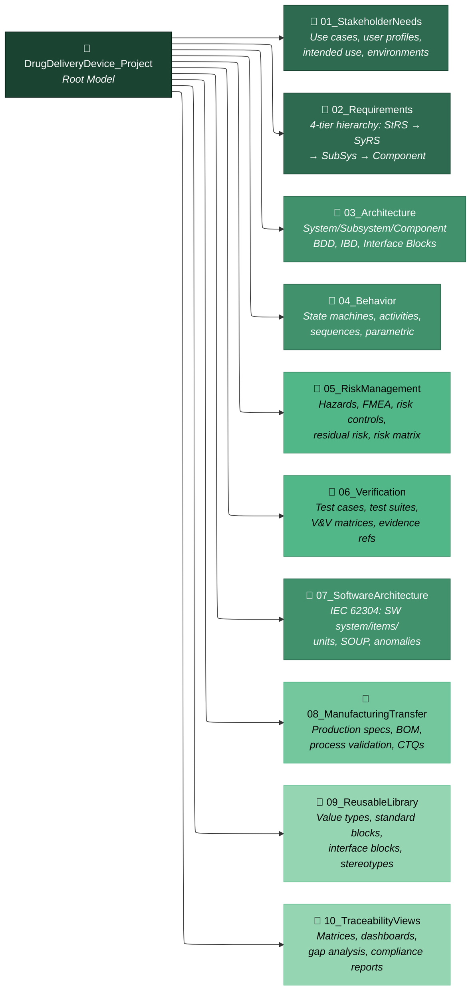

### B.3 Inter-package relationships — how packages connect
- Detailed description of what links to what and via which SysML relationship
- Requirements → Architecture (satisfy), Requirements → Verification (verify), Requirements → Requirements (deriveReqt)
- Risk elements → Architecture blocks (mitigate/trace), Risk controls → Verification (verify)
- Architecture → Manufacturing (allocate/trace), Architecture → Software Architecture (allocate)
- Issue/CAPA → Architecture + Requirements + Verification (trace)

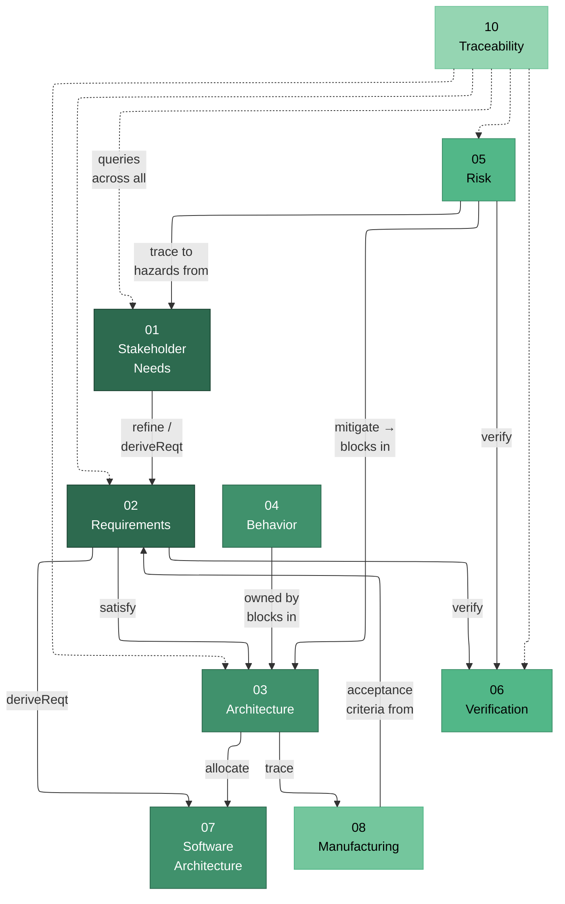

### B.4 Model as DHF/DMR backbone
- How the model replaces (or more precisely, indexes and structures) the Design History File
- Each DHF section maps to a model package and a generated document output
- The model is the authoritative source; documents are controlled projections
- DMR generation: BOM from BDD hierarchy, production specs from tagged blocks, acceptance criteria from verification links

### B.5 Discipline-specific views from one shared model
- Firmware team view: state machines, activity diagrams, software architecture blocks, IEC 62304 traceability
- Hardware team view: BDD component blocks with value properties, IBD interfaces, parametric constraints
- Quality/Risk team view: hazard chains, FMEA elements, risk control verification status, residual risk aggregation
- Verification team view: test cases, requirement coverage matrices, pass/fail dashboards
- Manufacturing team view: production spec blocks, BOM, CTQ characteristics, acceptance criteria

### B.6 Three-tier decomposition principle
- System → Subsystem → Component
- Each tier has defined SysML elements and required relationships
- Subsystem boundary rules: a subsystem owns components, interfaces with other subsystems via typed ports, and carries allocated requirements

### Diagrams in Part B
| Diagram | Mermaid Type | Purpose |
|---------|-------------|---------|
| Package hierarchy | Flowchart (TD) | Show the 10-package EA structure |
| Inter-package relationships | Flowchart (LR) | Show SysML relationship types between packages |
| DHF backbone mapping | Flowchart (LR) | Map DHF sections to model packages |
| Discipline views | Flowchart (TD) | Show how each team gets their view from one model |

---

## Part C — Standards-to-Model Mapping Rules

**File:** `Part_C_Standards_to_Model_Mapping.md`

### C.1 Standards interconnection diagram
- Visual showing how ISO 13485, IEC 60601-1, ISO 14971, IEC 62304, IEC 62366-1, and ISO 11608-4 relate
- Which standards invoke which other standards
- Where risk management (ISO 14971) acts as the spine connecting all others

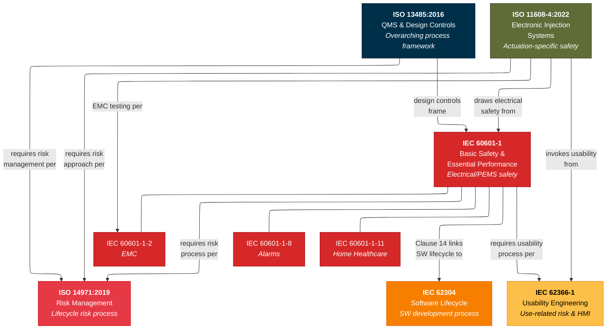

### C.2 ISO 13485 design controls → model structures
- Clause 7.3.1 (Planning) → Lifecycle Plan element, milestone breakdown, review gates
- Clause 7.3.2 (Inputs) → Requirement blocks with source metadata, EP tags, risk links
- Clause 7.3.3 (Outputs) → BDD/IBD blocks with satisfy links, acceptance criteria
- Clause 7.3.4 (Review) → Model baselines, review projection generation, findings as model elements
- Clause 7.3.5 (Verification) → Test cases with verify links, parametric verification
- Clause 7.3.6 (Validation) → Use case execution, clinical workflow validation
- Clause 7.3.7 (Change Control) → Baseline comparison, impact analysis, re-verification
- Clause 7.3.8 (Transfer) → Production spec blocks, BOM generation, process validation links
- Clause 7.3.9 (Post-transfer changes) → Version-controlled elements, engineering change notice
- Clause 7.3.10 (Design files) → Model as DHF index, generated document outputs
- Full clause-by-clause mapping table

### C.3 IEC 60601-1 → model elements
- Essential performance (Clause 4.3) → EP-tagged requirements, functions, parameters
- Single fault safety (Clause 4.7, 13.2) → Fault injection scenarios, state machine fault transitions
- PEMS (Clause 14) → Embedded control architecture blocks, PEMS requirement specs, defensive design allocation
  - Clause 14.2: PEMS lifecycle and milestone definition
  - Clause 14.3: Problem resolution system as model workflow
  - Clause 14.6: PEMS requirement specification → model requirements package
  - Clause 14.8: PEMS architecture → BDD/IBD with risk control allocation
  - Clause 14.10: PEMS verification → test cases for BS/EP/risk control functions
  - Clause 14.11: PEMS validation → system-level validation test cases
- Electrical safety (Clause 8) → MOOP/MOPP requirements, insulation boundary modeling in IBD
- Alarm systems (via IEC 60601-1-8) → alarm priority state machine, alarm requirement blocks
- Verification expectations → verification plan elements, coverage criteria, independence

### C.4 ISO 14971 → risk model structure
- Clause 4 (Risk analysis) → Hazard identification, hazardous situation elements, severity/probability
- Clause 5 (Risk evaluation) → Risk matrix as parametric constraint, acceptability determination
- Clause 6 (Risk control) → Risk control elements linked to design blocks via satisfy/mitigate
- Clause 7 (Residual risk evaluation) → Post-control risk assessment, verification evidence links
- Clause 8 (Overall residual risk) → Aggregation constraint block, benefit-risk analysis
- Clause 9 (Production and post-production) → Post-market monitoring hooks, CAPA linkage
- Risk as the model's spine: how every hazard connects to architecture, verification, and post-market

### C.5 IEC 62304 → software model structure
- Software safety classification (A/B/C) → SafetyClassification stereotype on SW blocks
- Software system → software items → software units hierarchy → package/block decomposition
- SOUP management → SOUP blocks with version, anomaly, and requirement tagged values
- Software architecture (Clause 5.3) → BDD for SW items, IBD for SW interfaces
- Software verification (Clause 5.5–5.7) → Test cases linked to SW requirements
- Software anomaly resolution (Clause 9) → Anomaly elements with state machine lifecycle

### C.6 IEC 62366-1 → usability model links
- Use specification (Clause 5.1) → Use case diagrams, user profiles, use environments
- Hazard-related use scenarios (Clause 5.3–5.4) → Activity diagrams for task flows, linked to hazards
- UI specification (Clause 5.6) → HMI subsystem BDD/IBD, display/button/alarm blocks
- Formative/summative evaluation (Clause 5.5) → Validation test cases linked to usability requirements
- Usability engineering file → model package with generated document outputs

### C.7 ISO 11608-4 → actuation-specific model requirements
- Essential performance for dose delivery → EP-tagged dose accuracy requirements
- Single fault safety for moving parts (Clause 8.10.4) → Locked rotor/jam failure modes, fault injection scenarios
- Motor-specific test conditions → Test case blocks with environmental constraints
- EMC by risk approach → EMC risks and mitigations linked to interfaces and behaviors
- Environmental stress (shock, vibration) → Requirements allocated to mechanical housing blocks

### C.8 Comprehensive standards mapping table
- Full clause-by-clause table: Standard | Clause | Requirement Topic | SysML Element Type | EA Artifact | DHF Document | Review Gate
- Covers all six primary standards plus collateral standards

### Diagrams in Part C
| Diagram | Mermaid Type | Purpose |
|---------|-------------|---------|
| Standards interconnection | Flowchart (TD) | Show how standards invoke/reference each other |
| ISO 13485 clause-to-model flow | Flowchart (LR) | Map design control clauses to model elements |
| Risk spine diagram | Flowchart (TD) | Show ISO 14971 as the connecting thread |
| IEC 62304 SW hierarchy | Flowchart (TD) | Show SW system → items → units decomposition |
| EP identification flow | Flowchart (LR) | Show how essential performance is identified and tagged |

---

## Part D — Modeling Conventions and Guidelines

**File:** `Part_D_Modeling_Conventions_and_Guidelines.md`

### D.1 Custom stereotypes (MDG Technology profile)
- Complete stereotype catalog with definitions, tagged values, and base metaclass
- «EPR» (Essential Performance Requirement) — extends Requirement
- «RiskControl» — extends Class
- «failureMode» — extends Class
- «hazard», «hazardousSituation», «harm» — extends Class
- «SOUP» — extends Class
- «SafetyClassification» — extends Class
- «productionSpec» — extends Class
- «anomaly» — extends Class
- «problemReport» — extends Class

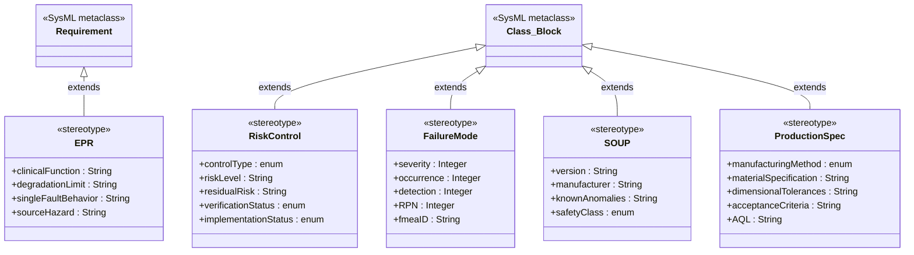

### D.2 Naming conventions
- Requirements: `STK-XXX` (stakeholder), `SYS-REQ-XXX` (system), `ACT-REQ-XXX` (subsystem-actuation), etc.
- Hazards: `H-XXX`, Hazardous situations: `HS-XXX`, Risk controls: `RC-XXX`
- Test cases: `TC-SYS-XXX`, `TC-INT-XXX`, `TC-RSK-XXX`
- Failure modes: `FM-ACT-XXX`, `FM-SNS-XXX`, `FM-IF-XXX`
- Interface blocks: `IFB_Source_Target` (e.g., `IFB_MCU_MotorDriver`)
- Baselines: `BL-[Gate]-v[Major].[Minor]-[Date]`

### D.3 Traceability relationship rules
- The "three-link minimum" rule: every requirement must have (1) upward trace, (2) satisfy link from design, (3) verify link from test case
- Five SysML requirement relationships: satisfy, verify, deriveReqt, refine, trace — when to use each
- Cross-package relationship patterns

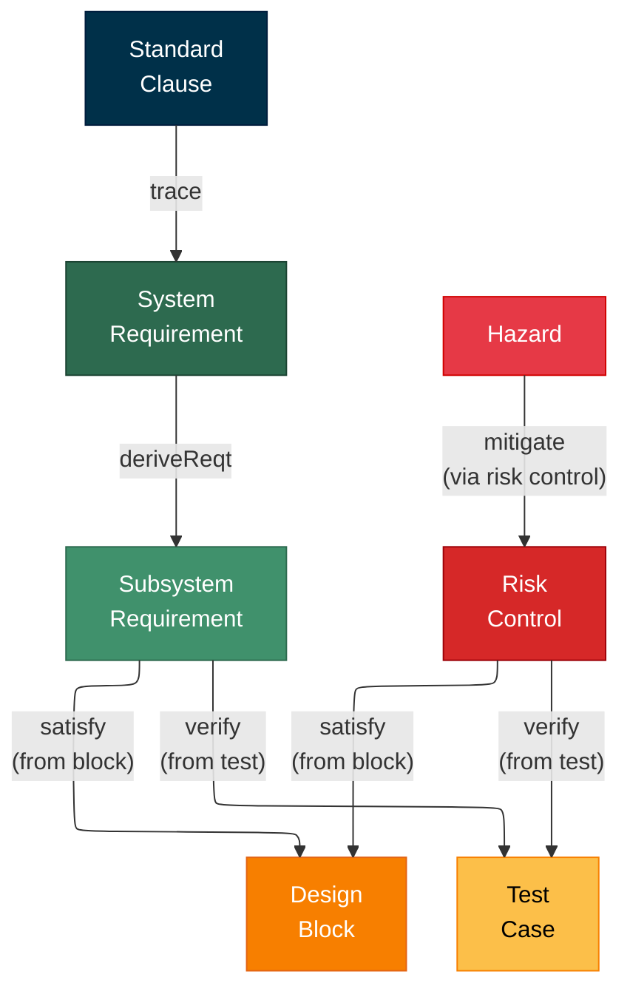

### D.4 Diagram selection decision tree
- When to use BDD vs IBD vs STM vs ACT vs SEQ vs PAR vs REQ
- BDD: structural decomposition and composition hierarchy
- IBD: interface definition, internal connectivity, port/flow specification
- STM: control logic, firmware states, fault transitions
- ACT: algorithms, process flows, operational sequences
- SEQ: time-ordered interactions between blocks (especially for safety protocols)
- PAR: engineering constraints, parametric relationships, simulation binding
- REQ: requirement hierarchy, traceability visualization

### D.5 Essential performance tagging rules
- What qualifies as EP: performance whose absence or degradation produces unacceptable risk
- EP is identified through risk analysis, not assumed
- EP tag applies to: requirements, functions (activity nodes), behaviors (state machine regions), parameters (constraint values)
- EP-tagged elements carry stricter verification requirements and change control

### D.6 Interface modeling standards
- Every cross-subsystem interface gets an interface block
- Interface blocks define signal names, data types, directions, protocols, timing constraints
- Proxy ports on blocks are typed by interface blocks
- Item flows on IBD connectors annotate what crosses each interface
- Each interface becomes an integration test target

### Diagrams in Part D
| Diagram | Mermaid Type | Purpose |
|---------|-------------|---------|
| Stereotype class diagram | Class diagram | Show all custom stereotypes with tagged values |
| Traceability relationship pattern | Flowchart (LR) | Show the three-link minimum and risk chain |
| Diagram selection decision tree | Flowchart (TD) | Guide for which SysML diagram to use when |

---

## Part E — Lifecycle Integration

**File:** `Part_E_Lifecycle_Integration.md`

### E.1 V-model mapping within the MBSE model
- Left side: decomposition (Stakeholder → System → Subsystem → Component)
- Right side: integration/verification (Unit Test → Integration Test → System Verification → Validation)
- Each layer has defined SysML artifacts on both sides
- Review gates at each transition

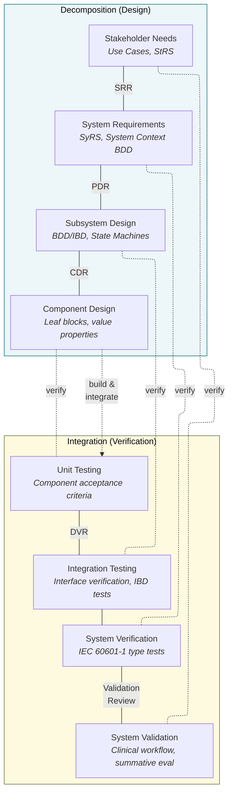

### E.2 Review gate definitions
- SRR (System Requirements Review): completeness of requirements, standards coverage, initial risk
- PDR (Preliminary Design Review): architecture frozen, all interfaces defined, satisfy links, preliminary FMEA
- CDR (Critical Design Review): detailed design frozen, full FMEA, 100% requirement-to-test coverage
- DVR (Design Verification Review): all requirements verified, all anomalies dispositioned
- Validation Review: clinical workflow validated, summative usability evaluation
- MRR (Manufacturing Readiness Review): production specs, BOM, process validation, acceptance tests
- Gate criteria expressed as model queries (e.g., "0 requirements without verify link at DVR")

### E.3 Baseline strategy
- Baselines aligned to review gates
- System Architecture Baseline (after PDR)
- Design Verification Baseline (after DVR)
- Manufacturing Transfer Baseline (after MRR)
- Post-release baselines for change control
- Baseline comparison for change impact analysis

### E.4 Verification strategy derived from standards
- IEC 60601-1 verification expectations for BS/EP/risk control functions
- Separation of type-testing (design verification) from manufacturing lot acceptance
- ISO 11608-4 dose accuracy verification with defined sample sizes
- PEMS verification plan: milestones, strategies, independence, tools, coverage, results

### E.5 Manufacturing transfer as an engineered transition
- Design outputs → production specifications (not a document handover)
- Manufacturing process blocks with CTQs linked to product requirements
- Test fixtures as system elements with calibration requirements
- Acceptance criteria linked to risk controls
- Production Specification Baseline as a controlled model snapshot

### E.6 Post-market integration hooks
- Complaint → Issue model element → impacted blocks/interfaces/behaviors
- CAPA workflow within the model: cause → corrective action → re-verification
- Post-market surveillance data feeding back to risk model updates

### Diagrams in Part E
| Diagram | Mermaid Type | Purpose |
|---------|-------------|---------|
| V-model mapping | Flowchart (TD) | Show decomposition/integration alignment |
| Review gate flow | Flowchart (LR) | Show gate sequence with criteria |
| Baseline timeline | Flowchart (LR) | Show baseline strategy across lifecycle |
| Issue-to-CAPA workflow | Flowchart (TD) | Show post-market feedback loop |

---

## Part F — Case Study Definition

**File:** `Part_F_Case_Study_Definition.md`

### F.1 Case study selection rationale
- Why a stepper-motor-driven peristaltic dosing module
- It exercises every framework layer: mechanical actuation, electronics, firmware, sensors, fluid path, safety logic
- It touches every applicable standard: ISO 13485 design controls, IEC 60601-1 PEMS/EP/single fault, ISO 14971 risk chain, IEC 62304 software lifecycle, IEC 62366-1 usability (dose setting UI), ISO 11608-4 actuator fault testing

### F.2 Subsystem scope and boundaries
- What is included: stepper motor, motor driver, pump mechanism, downstream pressure sensor, position encoder, application MCU (motor control + occlusion detection functions), safety MCU (MOTOR_KILL), relevant power rails
- What is excluded (modeled as external interfaces): HMI subsystem, BLE communication, reservoir/tubing consumables, battery management (treated as power input)
- System context boundary for the case study subsystem

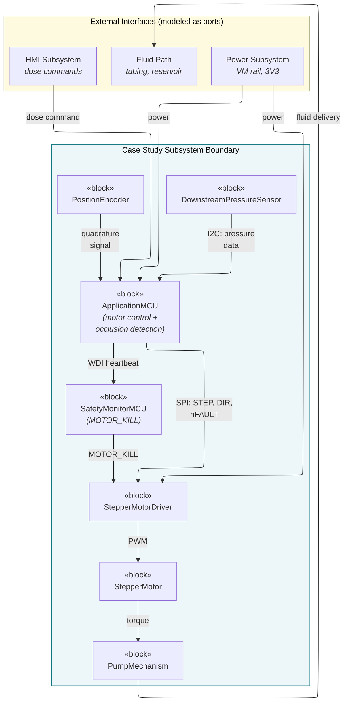

### F.3 Key interfaces to model
- MCU → Motor Driver (SPI + STEP/DIR/nFAULT): `IFB_MCU_MotorDriver`
- Pressure Sensor → MCU (I2C): `IFB_PressureSensor`
- Encoder → MCU (quadrature): `IFB_PositionEncoder`
- Application MCU → Safety MCU (heartbeat): `IFB_SafetyHeartbeat`
- Safety MCU → Motor Driver (MOTOR_KILL): `IFB_SafetyKill`
- Power Rail → Motor Driver (VM): `IFB_MotorPower`

### F.4 Key requirements to trace
- Dose accuracy (±5% for >10U) — EP-tagged, traced to ISO 11608-1
- Occlusion detection and alarm (within 30 seconds) — traced to IEC 60601-2-24
- Single fault safety for locked rotor/jam — traced to ISO 11608-4
- Safety MCU watchdog response (halt within 100ms) — traced to IEC 60601-1 Clause 14
- Motor stall detection — traced to ISO 11608-4

### F.5 Key behaviors to model
- Dosing state machine: IDLE → DELIVERING → SUSPENDED → FAULT
- Motor control activity: receive command → calculate steps → execute profile → check occlusion
- Safety heartbeat sequence: periodic WDI toggle, timeout detection, MOTOR_KILL assertion

### F.6 Key hazards and risk controls to trace
- H-001: Excessive drug delivery → RC: Safety MCU MOTOR_KILL → verified by TC-RSK-001
- H-002: Insufficient drug delivery (occlusion) → RC: Pressure differential algorithm + alarm → verified by TC-RSK-002
- H-003: Mechanical jam causing injury → RC: Current limiting + fault state → verified by TC-RSK-003

### F.7 How the case study threads through each framework part
- Table showing which case study element appears in each Part A–G section
- This becomes the verification that the framework is practical and connected

### Diagrams in Part F
| Diagram | Mermaid Type | Purpose |
|---------|-------------|---------|
| Subsystem context boundary | Flowchart (TD) | Show case study scope with external interfaces |
| Interface map | Flowchart (LR) | Show all six key interfaces |
| Requirement trace chain | Flowchart (LR) | Show dose accuracy requirement traced through all layers |
| Hazard-to-verification chain | Flowchart (TD) | Show one complete risk chain from hazard to test evidence |

---

## Part G — Governance and SOPs

**File:** `Part_G_Governance_and_SOPs.md`

### G.1 Model ownership and RACI
- System Architect: system-level BDD/IBD, requirement allocation, interface definitions
- Firmware Lead: state machines, activity diagrams, IEC 62304 software items
- Hardware Lead: electrical/mechanical subsystem blocks, PCB specifications
- Verification Lead: test case creation, execution tracking, V&V reporting
- Quality/Regulatory: risk model, standards mapping, CAPA linkage, DHF generation
- Manufacturing Engineering: production spec blocks, BOM, process validation

### G.2 SOP-MDL-001: Model creation procedure
- Initiation from approved Design & Development Plan
- Package setup per framework architecture (Part B)
- Element creation with naming conventions (Part D)
- Relationship definition with three-link minimum enforcement
- Review submission

### G.3 SOP-MDL-002: Model review procedure
- Trigger at each review gate (SRR, PDR, CDR, DVR, MRR)
- Cross-functional review team composition
- Review checklist (naming, traceability, interface completeness, state coverage, risk linkage)
- Finding classification (Critical/Major/Minor/Observation)
- Approval and action tracking

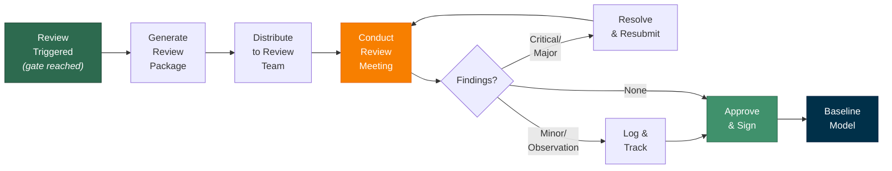

### G.4 SOP-MDL-003: Model baselining procedure
- Trigger events (gate completion, pre-transfer, pre-submission, post-change)
- Pre-baseline validation checks
- Baseline creation in EA (menu path, naming convention)
- Approval, archival, and read-only lock

### G.5 SOP-MDL-004: Model change control procedure
- Change request submission (MCR with rationale, affected packages)
- Impact analysis via traceability queries
- Risk assessment of proposed change
- Implementation in development branch
- Verification of change, peer review
- Re-baseline and communication

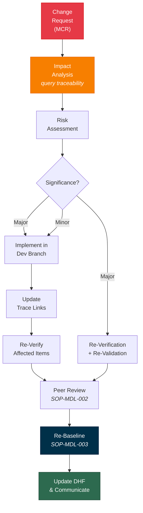

### G.6 Integration with existing QMS
- Model as a controlled document within the QMS (same review/approval/retention discipline)
- Model outputs (generated documents) as controlled records
- Audit trail via EA auditing feature
- 21 CFR Part 11 compliance considerations for electronic signatures

### G.7 Toolchain integration
- EA as the MBSE hub
- Links to ALM/issue tracker (CAPA records, defect tracking)
- Links to PLM (BOM synchronization, released design data)
- Links to test management (verification execution and results)
- OSLC-style linking patterns or proprietary API integration

### Diagrams in Part G
| Diagram | Mermaid Type | Purpose |
|---------|-------------|---------|
| RACI ownership diagram | Flowchart (TD) | Show who owns which model packages |
| Review workflow | Flowchart (LR) | Show SOP-MDL-002 process |
| Change control workflow | Flowchart (TD) | Show SOP-MDL-004 process |
| Toolchain integration | Flowchart (LR) | Show EA connections to ALM/PLM/test tools |

---

## Delivery sequence and checkpoints

| Step | Deliverable | Checkpoint before next |
|------|------------|----------------------|
| 1 | **This outline** — reviewed and confirmed | Agree on structure, scope, and sequencing |
| 2 | **Part A** notes (.md) + walkthrough | Scope, standards, objectives confirmed |
| 3 | **Part B** notes (.md) + walkthrough | Package hierarchy, inter-package links, DHF mapping confirmed |
| 4 | **Part C** notes (.md) + walkthrough | All standards mapped, comprehensive table reviewed |
| 5 | **Part D** notes (.md) + walkthrough | All stereotypes, naming, traceability rules confirmed |
| 6 | **Part E** notes (.md) + walkthrough | V-model, gates, baselines, verification strategy confirmed |
| 7 | **Part F** notes (.md) + walkthrough | Case study scope, interfaces, trace paths confirmed |
| 8 | **Part G** notes (.md) + walkthrough | SOPs, ownership, change control, QMS integration confirmed |
| 9 | **Begin EA build Phase 1** | All framework parts confirmed as the reference guide |

---

## What comes after the framework definition

Once all seven parts are confirmed, the framework definition becomes the **reference standard** for the EA build. Each EA build phase (Phase 1–10) will reference specific framework sections and implement them as model elements. The case study subsystem will be built incrementally through each phase, so by Phase 10 you have a complete, traced, verified example that proves the framework works in practice.
